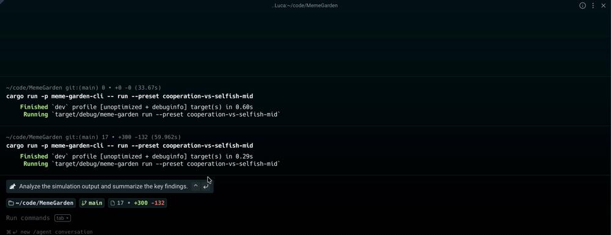
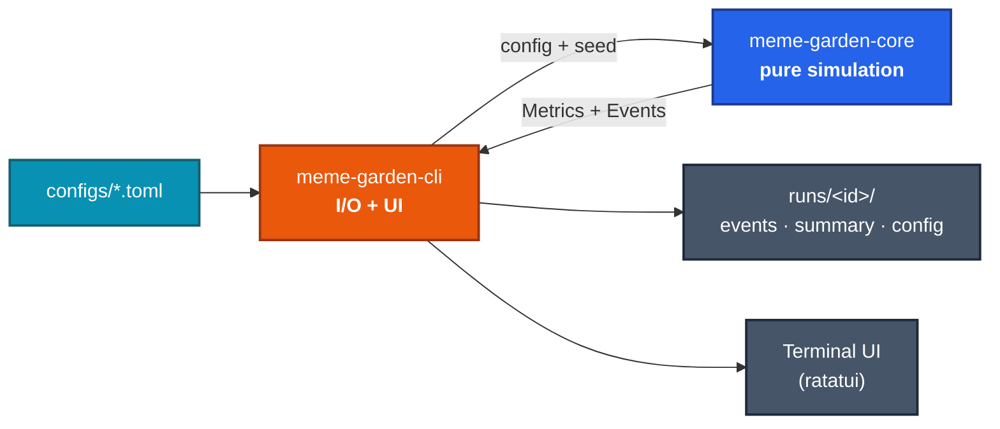
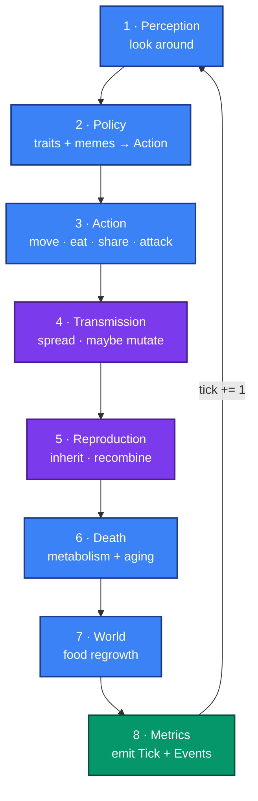
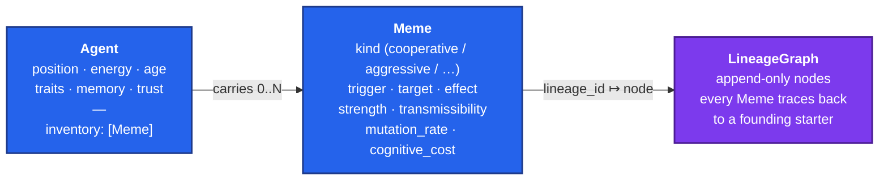

# Meme Garden

<p align="center">
  
</p>

A controlled **memetic petri dish**. Little agents live on a grid. They eat, move, share food, attack each other, copy their neighbors, and reproduce. They also carry **ideas** — small symbolic memes — that spread between them, mutate as they spread, and shape how their carriers behave. The whole point is to watch ideas behave like life and ask whether one strategy beats another.

---

## Index

1. [The idea](#the-idea)
2. [The question we want to answer first](#the-question-we-want-to-answer-first)
3. [What ships today](#what-ships-today)
4. [Quick start](#quick-start)
5. [Architecture at a glance](#architecture-at-a-glance)
6. [Config reference](#config-reference)
7. [Quick recipes](#quick-recipes)
8. [Tech spec](#tech-spec) — the engineering deep-dive

---

## The idea

Pretend culture is biology. An "idea" is not flavor text — it's an **object** in the simulation, a tiny rule like *"when next to a hungry friend, share food."* That rule sits in an agent's inventory the way a gene sits in a cell. When the agent interacts with a neighbor, the rule can copy itself over to the neighbor with some probability. Sometimes it copies with a small change — a mutation. Sometimes two rules in the same agent combine into a new one. Over hundreds of ticks, the simulator gives you a frame-by-frame view of which rules spread, which die out, and which mutate into something unrecognizable.

The interesting part is that the rules **affect the host's behavior**. Carrying *"share with allies"* makes you more likely to give energy away. Carrying *"attack low-energy outsiders"* makes you more likely to predate on weaker strangers. Conflicting rules can't quietly coexist in the same agent — when a contradictory new meme arrives, the carrier either rejects it, gets converted, or fuses the two into a hybrid child. So the world is a tug-of-war: cooperators bleed energy by sharing, predators pay attack costs and risk retaliation, and the question of which kind of agent is fittest is *not* settled in advance — the simulator settles it for us, deterministically, given a seed.

We deliberately avoided giving agents natural language or LLM-generated thoughts. Memes are bounded symbolic structures — finite enums plus a few numbers — so the simulation is fast, debuggable, and reproducible to the byte. That matters: if you want to take conclusions out of this, you need to be able to re-run an experiment and get the same answer.

---

## The question we want to answer first

> **Can a cooperative meme survive against a selfish meme under different levels of scarcity, mutation, and social copying?**

The MVP answers it end-to-end. Three shipped presets — `cooperation-vs-selfish-low`, `-mid`, `-high` — run the same experiment under increasingly tight food supply (food at 100% / 50% / 20%).

Populations here are small (tens of agents) and meme prevalence drifts, so any single seed is noise. The milestone is therefore recorded as a **win-rate across a 16-seed sweep** (seeds 1–16, horizon 1000) — not one cherry-picked run. A "win" means that side's prevalence leads among the survivors at horizon:

| Scarcity | Cooperative wins | Aggressive wins | Total collapse | Mean population |
|---|---|---|---|---|
| low (food abundant) | **14 / 16** | 2 / 16 | 0 / 16 | ~71 |
| mid (food halved)   | **11 / 16** | 5 / 16 | 0 / 16 | ~17 |
| high (food at 20%)  | 3 / 16 | 3 / 16 | **10 / 16** | ~0 |

The answer: **cooperation is broadly viable.** Once predation carries real risk (an attacked agent fights back) and sharing is positive-sum (energy is worth more to a starving neighbour than to a full one), the cooperative meme usually wins under abundant and moderate food. Only under extreme scarcity does the outcome stop being about memes at all — the whole population starves before either side settles anything.

The full per-tick event stream for any run is in `runs/<id>/events.jsonl` for anyone who wants to ask the data different questions.

---

## What ships today

The simulator runs the full life-cycle described above and writes everything to disk:

- A grid world where agents move, eat, share, attack, imitate, transmit, reproduce, and die. Death has three causes: starvation, aging, combat.
- Bounded **symbolic memes** with a trigger, a target, an effect, a strength, and a few probabilities. Six starters ship in the box: share with allies, avoid strangers, copy high-energy agents, attack low-energy outsiders, punish non-sharers, prefer agents with the same meme.
- **Mutation and recombination** with full lineage tracking — every meme alive at any tick traces back through its ancestors to a founding starter.
- **A live terminal UI** (the GIF up top) with the world on the left and a chart of meme prevalence over time on the right.
- **A headless mode** that produces byte-identical output to the TUI for the same seed.
- **A self-describing run artifact**: every run writes its resolved config, a JSON-Lines event stream, and a flat CSV summary, all under `runs/<timestamp>-<name>/`.

The whole thing has **51 tests**, runs **1000 ticks in under a second** in release mode, and is **bit-identical** across reruns with the same seed. The constitution that keeps it that way lives at [`.specify/memory/constitution.md`](.specify/memory/constitution.md).

---

## Quick start

```sh
# The milestone, one command:
cargo run --release -p meme-garden-cli -- headless \
  --preset cooperation-vs-selfish-low --seed 42

# The same world, but you can watch:
cargo run -p meme-garden-cli -- run \
  --preset cooperation-vs-selfish-mid --seed 42

# See what's in the box:
cargo run -p meme-garden-cli -- list-presets

# Talk to a finished run:
cargo run -p meme-garden-cli -- analyze runs/<some-run>/
```

Inside the TUI: `space` to pause, `s` to single-step, `+` / `-` to speed up or down, `q` to quit. The right pane shows live prevalence per meme kind; the left pane shows agents (`C` = cooperative carrier, `S` = aggressive carrier, `X` = both, `a` = no relevant meme) and food (`.`).

---

## Architecture

The project is two Rust crates. **Core is pure** — no terminal, no network, no filesystem writes. The **CLI** wraps it, owns I/O, and presents the TUI or the headless runner.



AI providers (`MemeNamer`, `ExperimentDesigner`, `RunAnalyst`) plug in behind traits in `core::ai` with a `NoopProvider` default. They're called only from CLI commands — never from the per-tick loop.

One tick of the simulation is a fixed sequence of phases. Reordering them is a breaking change — the determinism gate fires immediately:



Blue phases are the biological life-cycle. Purple phases are where memes evolve — spread, mutate, recombine. Green is the metrics gate, where one tick's outcome leaves the simulator.

And the data inside the simulator — what an Agent and a Meme actually look like — is bounded and small:



That's the whole mental model. Memes are inventory items. Inventory items bias behavior. Behavior changes who's adjacent to whom next tick, which changes who transmits what, which changes which memes survive.

---

## Config reference

Every run is a TOML file. Below is every section, every knob, and what turning it does.

### `[world]` — the grid

| Param | Meaning |
|---|---|
| `width` | Grid columns. |
| `height` | Grid rows. Agents can stack on the same cell. |

Bigger grid → agents spread out, transmission slows. Smaller grid → forced contact, faster spread, more fights.

### `[agents]` — population & life-cycle

| Param | Meaning |
|---|---|
| `count` | Initial agent population. |
| `starting_energy` | Energy each agent spawns with. Also the baseline for the `Hungry` trigger (`< 0.5 ×`) and the `LowEnergyAgent` target. |
| `metabolism` | Energy lost per tick by every living agent, before action costs. |
| `max_energy` | Hard cap. The `HighEnergyAgent` threshold is `0.75 ×` this. |
| `max_age` | Ticks before death by aging. |
| `initial_traits_dist` | Probabilities summing to 1.0: `[Generous, Cautious, Aggressive, Conformist]`. Traits bias per-tick action weights. |
| `trait_mutation_rate` | Per-trait chance at reproduction that an inherited trait re-rolls. |

### `[food]` — the resource

| Param | Meaning |
|---|---|
| `initial_density` | Fraction of cells seeded with food at tick 0. |
| `regrowth_rate` | Per-empty-cell, per-tick chance of food growing. |
| `energy_per_food` | Energy gained when eating one food unit. |

### `[scarcity]` — convenience knob

| Param | Meaning |
|---|---|
| `level` | One of `low` (1.0× food), `mid` (0.5×), `high` (0.2×), `custom` (leave food values untouched). Multiplied into `food.initial_density` and `food.regrowth_rate` at load time. |

This is why the three milestone presets are byte-identical except for this one line.

### `[cognition]` — bounded inventory

| Param | Meaning |
|---|---|
| `inventory_cap` | Max memes per agent. On overflow the **oldest** meme is dropped FIFO and a `MemeForgotten` event fires. |

### `[transmission]` — how memes spread

| Param | Meaning |
|---|---|
| `base_rate` | Multiplied into every transmission roll. `0` disables transmission entirely. |
| `social_copying_bias_mean` | Mean of the per-agent "how willing am I to adopt new ideas" trait, sampled at birth. |
| `social_copying_bias_std` | Spread of that per-agent draw. |
| `prestige_boost` | Additive bonus when the transmitter is in the top-quartile of energy. |

The roll for "does meme M move from A to B this tick" is `base_rate × meme.transmissibility × B.social_copying_bias`, plus `prestige_boost` if A is high-energy, clamped to `[0, 1]`.

### `[mutation]` — how memes change

| Param | Meaning |
|---|---|
| `strength_jitter_max` | Max ± delta on `strength` on a mutation event. Clamped to `[0, 1]`. |
| `enum_swap_probability` | Probability a mutation event swaps one of `trigger`, `target`, or `effect` to a different variant. |

The per-meme `mutation_rate` gates *whether* mutation fires on a transmission; these knobs control *how big* the change is. Mutation preserves the meme's `kind`.

### `[conflict]` — what happens when opposite memes meet

Some memes can't sensibly coexist in the same agent — `Cooperative` and `Aggressive` are the first such pair. When transmission, imitation, or inheritance would deliver a conflicting meme to a carrier of its opposite, the simulator rolls one of three outcomes: **reject** (keep the old one), **replace** (drop the old, keep the new), or **recombine** (fuse both into a hybrid child meme, drop both originals).

| Param | Meaning |
|---|---|
| `recombine_share` | Fraction of contested acquires that fuse the two memes via recombination. The remaining share splits between reject and replace, weighted by relative `strength` — stronger new memes win replace rolls more often. |

Default is `0.20`. Set to `0` to disable fusing entirely (everything becomes reject-or-replace). Set high to bias toward hybridization.

### `[reproduction]` — making new agents

| Param | Meaning |
|---|---|
| `energy_threshold` | Both parents must be at or above this energy. |
| `offspring_energy_cost` | Energy each parent pays. |
| `inherit_meme_prob` | Per-parent-meme probability of inheritance. |
| `min_age` | Minimum age to reproduce. |

Recombination of two parental memes fires with a fixed 20% chance when both parents have non-empty inventories.

### `[attack]` — combat

| Param | Meaning |
|---|---|
| `energy_cost_attacker` | Energy the attacker spends. |
| `energy_steal` | Energy transferred from victim to attacker (capped at victim's energy). |
| `retaliation_chance` | Probability that a victim who survives the hit strikes back, dealing `energy_steal` damage to the attacker (a deterrent — that energy is destroyed, not transferred). Makes unprovoked predation risky instead of free profit. |

Attacks also drop the victim's trust in the attacker, mark the victim as recently attacked (which feeds the `AttackedRecently` trigger for 10 ticks), and kill the victim if energy reaches zero.

### `[sharing]` — the cooperative action

| Param | Meaning |
|---|---|
| `share_threshold` | Donor only shares if its own energy is above this. |
| `share_amount` | Energy the donor spends per share. The donor's trust in the recipient bumps `+0.10`. |
| `recipient_multiplier` | The recipient gains `share_amount × recipient_multiplier`. Above `1.0`, sharing is **positive-sum** — energy is worth more to a starving agent — so cooperative clusters can out-reproduce instead of merely bleeding. Defaults to `1.0` (zero-sum) for legacy configs. |

### `[[memes.seed]]` — initial meme pool

A repeated table — one entry per seeded meme.

| Param | Meaning |
|---|---|
| `name` | One of the six starters: `share_with_allies`, `avoid_strangers`, `copy_high_energy`, `attack_low_energy_outsiders`, `punish_non_sharers`, `prefer_same_meme`. |
| `carrier_fraction` | Per-agent probability of starting with this meme. |

Each agent receives **at most one** starter at tick 0 — the pool is treated as a categorical draw. So two entries at `0.5` each give ~50% of agents the first meme, ~50% the second, and 0% none. If the entries sum to less than 1.0, the remaining probability is the chance of starting empty (which leaves transmission room to do work). If they sum to more than 1.0, the weights are normalized.

### `[run]` — execution control

| Param | Meaning |
|---|---|
| `seed` | The **only** randomness source. Same seed + same config = bit-identical metrics. |
| `horizon` | Max ticks. Overridable via `--ticks`. |
| `stop_on_extinction` | If `true`, terminate at the first population extinction. Default `false` keeps emitting metrics so the post-extinction tail is visible. |
| `cluster_snapshot_every` | Cadence (in ticks) for Jaccard-similarity cultural-cluster snapshots. `0` disables. |
| `metrics_emit_every` | Cadence for per-tick metric emission. Raise it for shorter `events.jsonl`. |
| `survival_threshold` | Prevalence a meme must clear at horizon to be reported as "survived." |

---

## Quick recipes

- **Make cooperation fail.** Set `sharing.recipient_multiplier = 1.0` (sharing back to zero-sum, so cooperators only bleed) and lower `attack.retaliation_chance` toward `0` (predation becomes a free lunch). Raising `agents.metabolism` and lowering `food.regrowth_rate` on top of that starves donors faster than they can recover.
- **Maximize mutation drift.** Raise `mutation.strength_jitter_max` and `mutation.enum_swap_probability` toward 1.0.
- **Pure deterministic baseline (no mutation, no trait drift).** Set `mutation.strength_jitter_max = 0`, `mutation.enum_swap_probability = 0`, `agents.trait_mutation_rate = 0`. Memes still spread but never change.
- **Fast-forward a sweep.** Set `metrics_emit_every = 10`, `cluster_snapshot_every = 0`, raise `--ticks`. Same simulation, ~10× smaller `events.jsonl`.
- **Bias conflict toward hybridization.** Raise `conflict.recombine_share` toward 1.0 — every contested acquire fuses the two memes into a recombined child instead of one displacing the other.
- **Force a single-meme world.** Drop one `[[memes.seed]]` entry and bump the remaining one to `0.9+`. Useful for "does this meme spread on its own merits" tests.
- **Test a meme's solo viability.** Seed only one starter at `carrier_fraction = 0.05`. Check whether it reaches `≥ run.survival_threshold` by horizon.
- **Reproducibility sanity check.** Run twice with the same seed. The hash of `tail -n +2 events.jsonl` (i.e. everything after the run-id-bearing header) must match.

---

---

# Tech spec

Everything below is for someone reading or editing the code. The narrative above is what the project *is*; this section is how it *works*.

## Workspace layout

```
crates/
  meme-garden-core/         simulation engine — pure, deterministic, no I/O
    src/
      lib.rs                public surface + CORE_VERSION
      rng.rs                SimRng — the ONLY randomness source (Pcg64Mcg)
      config.rs             SimConfig + sub-configs + validate + legacy adapter
      world.rs              Simulation + 8-phase tick loop + Grid
      agent.rs              Agent, AgentId, AgentTrait, AgentMemory, TrustMap
      meme.rs               Meme + Trigger/TargetSelector/Effect/MemeKind enums
      action.rs             Action enum (Move/Eat/Share/Attack/Imitate/Transmit/Reproduce/Idle)
      policy.rs             per-tick compute_action + Perception + NeighborInfo
      mutation.rs           mutate_in_place + recombine
      lineage.rs            LineageGraph (append-only, traces to starter)
      starters.rs           six starter meme constructors + STARTERS table
      metrics.rs            Metrics + Event enum + shannon/top1 helpers
      ai.rs                 MemeNamer / ExperimentDesigner / RunAnalyst + NoopProvider
    tests/                  9 integration test files
  meme-garden-cli/          binary: TUI + headless runner
    src/
      main.rs               clap subcommands (run | headless | list-presets | export | analyze | experiment)
      runner.rs             shared tick loop + default_run_id timestamp generator
      export.rs             RunWriter (JSONL + CSV + config.toml) + export helpers
      app.rs                TUI state (history ring + tps + pause)
      tui.rs                ratatui rendering (grid + sparkline)
    tests/                  4 CLI integration test files (headless, sweep, export_roundtrip, list-presets)
configs/
  default.toml              baseline parameters
  presets/                  shipped milestone presets (low/mid/high scarcity)
docs/
  design.md                 long-term vision (north star, not spec)
  meme-grammar.md           the symbolic grammar in detail
  assets/                   README assets (gif)
runs/                       per-run artifacts (gitignored except .gitkeep)
specs/001-meme-garden-mvp/  executable spec: spec.md, plan.md, tasks.md, contracts/
.specify/memory/constitution.md   project principles (binding rules)
```

## The 8-phase tick loop in detail

Implemented in `crates/meme-garden-core/src/world.rs::Simulation::step`. Phase order is the determinism contract; reordering changes outputs and breaks the regression test.

1. **`perception_phase` (`world.rs`)** — for every agent, build a `Perception` struct (`policy.rs`): adjacent food cells, 4-cell-radius neighbors with classifications (trust, kin, shares-meme, high/low-energy), the `hungry` flag (`energy < 0.5 × starting_energy`), the `attacked_recently` flag (last attack within 10 ticks). Read-only.

2. **`policy_phase` (`world.rs`)** — for each living agent in `AgentId` order, call `policy::compute_action`. The algorithm: start from an 8-slot baseline weight array (one slot per action category); multiply by trait modifiers (`Generous` × 1.4 on Share, `Cautious` × 0.6 on Attack, etc.); bias by hunger and adjacent food; gate reproduction by energy + age + partner; **for each meme whose `trigger` matches the perception, multiply the weight of `effect_to_category(meme.effect)` by `(1 + meme.strength)`**; zero out categories with no valid target (e.g. no adjacent hungry ally → Share weight 0). Sample via `SimRng`, then turn the category into a concrete `Action` by picking a target (e.g. `pick_share_target`, `pick_attack_target`).

3. **`action_phase` (`world.rs`)** — apply each chosen `Action` in `AgentId` order. Decrements `energy` by `metabolism + Σ cognitive_cost`; emits `Event::Death { cause: Starvation }` on `energy ≤ 0`. `Share`, `Attack`, and `Imitate` mutate the relevant agents and the trust map. `Share` gives the recipient `share_amount × recipient_multiplier` while the donor pays `share_amount`. `Attack` steals `energy_steal`; if the victim survives, it strikes back with probability `retaliation_chance` for `energy_steal` damage to the attacker. `Imitate` inherits the target's first novel meme into the imitator's inventory (subject to `inventory_cap`; oldest gets evicted FIFO, emitting `MemeForgotten`).

4. **`transmission_phase` (`world.rs`)** — independent from `Action::Transmit`; runs over all (agent, meme) pairs for every adjacent neighbor. Roll `p = base_rate × meme.transmissibility × recipient.social_copying_bias (+ prestige_boost if sender is top-quartile energy)` via `SimRng::gen_bool`. On success, allocate new `MemeId` + lineage node (`LineageOrigin::Inheritance`), then roll `meme.mutation_rate`; if it hits, call `mutation::mutate_in_place` and (on a real mutation) allocate a second lineage node (`LineageOrigin::Mutation`). A mutation that swaps the `effect` field re-derives the meme's `kind` from its new behaviour (`share → cooperative`, `attack → aggressive`). Apply `inventory_cap` and push. Emit `Event::Transmission` and (on mutation) `Event::Mutation`.

5. **`reproduction_phase` (`world.rs`)** — iterate in `AgentId` order; for each agent meeting `energy ≥ reproduction.energy_threshold && age ≥ reproduction.min_age`, find an adjacent partner with the same energy precondition (i < j to avoid double counting). Both parents pay `offspring_energy_cost`. Offspring takes traits inherited from union of parents with `agents.trait_mutation_rate` per-trait reroll, social-copying-bias = average of parents, and memes inherited per parent at `reproduction.inherit_meme_prob` (each gets a fresh `MemeId` + `LineageOrigin::Inheritance` node). With 20% probability and a free inventory slot, fuse `parents[i].inventory[0]` and `parents[j].inventory[0]` via `mutation::recombine` (the child's `kind` is derived from its resulting `effect`, then routed through conflict resolution so it can't violate the no-two-conflicting-memes invariant) → `Event::Recombination`. Emit `Event::Birth`.

6. **`death_phase` (`world.rs`)** — agents with `age ≥ max_age` die (`cause: Aging`). Trust map entries decay by 1% per tick; entries with `|trust| < 0.05` are dropped.

7. **`world_maintenance_phase` (`world.rs`)** — for each empty cell, `SimRng::gen_bool(food.regrowth_rate)` to spawn food. O(W·H) per tick.

8. **`emit_metrics_phase` (`world.rs`)** — walk all living agents to compute per-tick aggregates: `population_by_trait` counts, `meme_count`, `carriers_by_kind[7]` (carriers, not instances, per `data-model.md`), `meme_prevalence_by_kind = carriers / alive`, `mean_energy`, `mean_age`. Then `diversity_shannon = shannon_diversity(prevalence)` and `dominance_top1_fraction = top1_fraction(prevalence)`. Emit `Event::Tick(Box<Metrics>)`. Detect first-time population/meme extinction and emit `Event::Extinction` exactly once each. Every `run.cluster_snapshot_every` ticks, run `compute_clusters` (Jaccard on inventory-kind sets, threshold `0.6`) → `Event::ClusterSnapshot`.

After phase 8, `tick += 1` and the next call to `step()` repeats.

## Determinism contract

`crates/meme-garden-core` MUST NOT touch `std::time`, `rand::thread_rng`, environment variables, process IDs, or any other ambient nondeterminism. Every stochastic decision goes through `rng::SimRng`, which is owned by `Simulation` and constructed from the `(config, seed)` pair in `Simulation::new`. The CLI's `runner::default_run_id` is the only place a wall-clock dependency lives — it generates the run directory name **before** `Simulation::new` is called, so the timestamp never enters the metrics stream.

The contract has two tripwires:

- `crates/meme-garden-core/src/world.rs::tests::same_seed_same_metrics` — paired `Simulation` instances with the same seed produce identical event JSON for 100 ticks.
- `crates/meme-garden-core/tests/milestone.rs::milestone_direction_is_recorded` — the cooperative-vs-selfish experiment's *direction* of survival under low/mid/high scarcity is stable across re-runs. If the simulator changes shape, this fails and the milestone outcome has to be reconfirmed deliberately.

## Run artifacts

Each run writes three files under `runs/<YYYYMMDD-HHMMSS>-<short-name>/`, created by `crates/meme-garden-cli/src/export.rs::RunWriter`:

- `config.toml` — byte-identical resolved configuration (after `scarcity.apply_scarcity()`), so the artifact is self-describing.
- `events.jsonl` — line-delimited JSON. First record is `{"kind":"header","schema_version":1,"run_id":"...","core_version":"..."}`. Subsequent records are tagged-union `Event`s: `tick`, `birth`, `death`, `transmission`, `mutation`, `recombination`, `meme_forgotten`, `extinction`, `cluster_snapshot`.
- `summary.csv` — flat per-tick summary, header first row. Same first columns as the POC's CSV for backward-compatible tooling.

`RunWriter::finalize` flushes and `fsync`s both files so a `kill -9`'d run leaves recoverable artifacts. The contract for the JSONL stream lives at [`specs/001-meme-garden-mvp/contracts/metrics.schema.md`](specs/001-meme-garden-mvp/contracts/metrics.schema.md).

## Constitution principles (binding)

From [`.specify/memory/constitution.md`](.specify/memory/constitution.md):

- **I. Determinism Is Sacred (NON-NEGOTIABLE)** — every RNG flows through `SimRng`; same `(seed, config)` ⇒ bit-identical metrics.
- **II. Pure Core, Impure Edges** — `meme-garden-core` reads config but writes nothing; the CLI owns file I/O and the TUI.
- **III. Stable Iteration Order** — agents are processed in `AgentId` order; `HashMap` iteration is banned in the hot path.
- **IV. Symbolic Memes, Not Black Boxes** — memes are bounded `{trigger, target, effect, strength, transmissibility, mutation_rate, cognitive_cost, lineage}`; no LLM or arbitrary-code execution inside `Simulation::step`.
- **V. Metrics-First Experimentation** — every behavioral claim must be answerable from the metrics stream, not from eyeballing the TUI.

PRs that touch the simulator MUST address each principle in the description (even if only to assert "no constitutional impact").

## Tests

```sh
cargo test --workspace
```

47 tests across 13 files. The load-bearing ones:

- `world::tests::same_seed_same_metrics` — Principle I gate.
- `crates/meme-garden-core/tests/milestone.rs::milestone_direction_is_recorded` — survival-direction regression.
- `crates/meme-garden-core/tests/tui_headless_equivalence.rs::drain_cadence_does_not_affect_outputs` — proves the TUI cannot influence the metrics stream.
- `crates/meme-garden-core/tests/lineage.rs::every_live_meme_traces_to_a_starter` — lineage closure invariant.
- `crates/meme-garden-core/tests/mutation.rs::mutated_memes_stay_in_enum_ranges` — bounded-mutation invariant.

## What's next

Tracked in [`specs/001-meme-garden-mvp/tasks.md`](specs/001-meme-garden-mvp/tasks.md) and `## Open follow-ups` of `research.md`:

- LLM-backed implementations of the three AI seams (in a future `meme-garden-ai` crate; `meme-garden-core` stays HTTP-free).
- A lineage-tree visualization pane in the TUI.
- A `sweep` subcommand that runs a parameter grid in one invocation.
- A `replay` subcommand that re-renders a finished run from `events.jsonl` without re-running the simulator.
- Mutation of `transmissibility` and `mutation_rate` themselves (currently fixed per-meme, by design — keeps the milestone interpretable).
- Connected-component cultural clusters (currently Jaccard threshold-based).
- Property-based fuzzing of the mutation operator (`proptest`).
- Removing the legacy-config adapter in `config.rs` (deferred from MVP polish; see `tasks.md::T080`).
